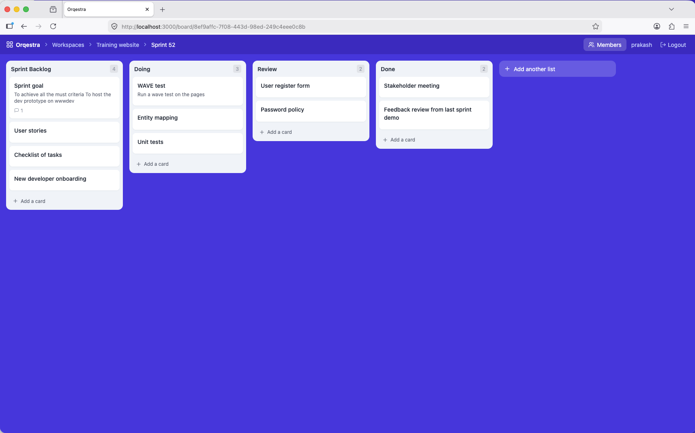
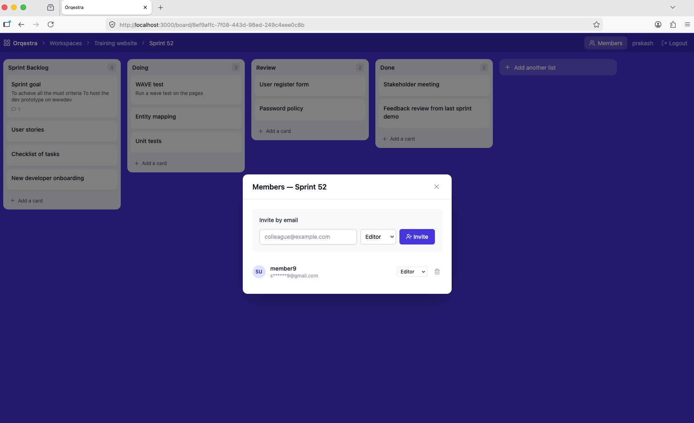

# Orqestra - An event-driven collaboration and workflow platform

Orqestra is an actively developed platform for orchestrating workflows, entities, and collaboration in real time. It is designed with an event-driven architecture to support scalable, distributed systems across research and enterprise environments.

The platform focuses on structured data, real-time updates, searchability, and full auditability of system activity.


## 🚀 Current Status

⚠️ Work in Progress (early prototype)

- Project setup (Flask + React)
- Authentication (JWT-based)
- Core entity management (workspaces, boards, columns, cards)
- Extensible metadata schema (JSONB)
- Role-based access control (RBAC)
- Event / audit logging (foundation for activity streams)
- Trello-like board UI with drag-and-drop
- OpenSearch integration (early / planned)


## 🧠 Problem Statement

Modern collaboration and workflow systems often suffer from:

- Limited extensibility beyond simple "tasks"
- Poor visibility into system activity and history
- Weak search across entities and interactions
- Lack of real-time collaboration capabilities
- Tight coupling between components (hard to scale)

Orqestra addresses these gaps by introducing:

- An event-driven architecture
- Extensible entity models (not limited to tasks)
- Real-time updates and activity streams (planned)
- Search-first design with OpenSearch
- Auditability and traceability by design


## 🏗️ Architecture Overview

### Core Components
- **Backend:** Flask (Python)
- **Frontend:** React + TypeScript + Vite
- **Database:** PostgreSQL
- **Search Engine:** OpenSearch (planned)
- **Event Layer:** Planned – async/event-driven pattern
- **Storage:** AWS S3 (planned)
- **Deployment:** Docker Compose (local), AWS EC2 (planned)

### High-Level Flow
```
(Client - React)
        ↓
(Flask Backend / API Layer)
        ↓
(Event Layer - Planned)
   ↓              ↓
(PostgreSQL)   (OpenSearch)
        ↓
(Optional Storage - S3)
```

## 🔑 Core Features
- User authentication (JWT-based)
- Role-based access control (RBAC – admin / member / viewer)
- Generic entity management (workspaces, boards, columns, cards)
- Trello-like board UI with drag-and-drop cards
- Event logging and audit streams
- Full-text and faceted search (OpenSearch – planned)
- Versioning of entities (planned)
- RESTful API design


## 🧩 Design Principles
- Event-driven first → every action is an event
- Extensibility → not limited to "tasks"
- Search-centric → OpenSearch as a core component
- Auditability → trace everything
- Scalability → loosely coupled components
- Cloud-ready → AWS-native deployment path


## 📦 Project Structure

```
repo-root/
│
├── backend/
│   ├── app/
│   │   ├── main.py               # Flask app factory
│   │   ├── extensions.py         # db, jwt, cors
│   │   ├── api/
│   │   │   ├── deps.py           # auth decorators
│   │   │   ├── routes.py         # blueprint registration
│   │   │   └── v1/
│   │   │       ├── auth.py
│   │   │       ├── users.py
│   │   │       ├── entities.py
│   │   │       └── events.py
│   │   ├── core/
│   │   │   ├── config.py         # pydantic-settings
│   │   │   └── security.py       # password hashing
│   │   ├── models/               # SQLAlchemy models
│   │   └── schemas/              # Pydantic schemas
│   ├── server.py                 # entrypoint
│   ├── requirements.txt
│   ├── Dockerfile
│   └── .env.example
│
├── frontend/
│   ├── src/
│   │   ├── api/                  # axios client + endpoints
│   │   ├── store/                # Zustand state (auth, board)
│   │   ├── types/                # TypeScript types
│   │   ├── components/           # ui/, layout/, board/
│   │   └── pages/                # Login, Register, Workspaces, Board
│   ├── package.json
│   └── .env.example
│
├── docs/
│   └── architecture.md
│
├── docker-compose.yml
├── .gitignore
└── README.md
```


## 🐳 Running with Docker Compose (recommended)

### Prerequisites
- [Docker](https://docs.docker.com/get-docker/) and Docker Compose installed

### 1. Clone the repo

```bash
git clone <repo-url>
cd Orqestra
```

### 2. Configure environment

Copy the backend env example and set a secret key:

```bash
cp backend/.env.example backend/.env
```

Edit `backend/.env` and set a strong `SECRET_KEY`:

```
SECRET_KEY=your-random-secret-here
```

Generate one with:

```bash
python -c "import secrets; print(secrets.token_hex(32))"
```

### 3. Build and start all services

```bash
docker compose up --build
```

This starts three services:

| Service | URL | Description |
|---|---|---|
| `frontend` | http://localhost:3000 | React UI |
| `backend` | http://localhost:8000 | Flask API |
| `db` | localhost:5432 | PostgreSQL |

### 4. Register and log in

Open **http://localhost:3000** in your browser. You will be redirected to the login page.


Click **Sign up** to create your account, then log in. No pre-seeded users exist — the first account you register is yours.

### 5. Create a workspace

After logging in you land on the Workspaces page. Click **+ New workspace**, give it a name, and hit **Create**.


### 6. Create a board

Click into a workspace and create your first board with **+ New board**.


### 7. Add columns and cards

Open a board to get the Dashboard view. Use **+ Add another list** to create columns, then **+ Add a card** inside each column. Cards can be dragged between columns, edited, and commented on.



### 8. Invite members

CLick on member option to add/remove members to the board and set their role either as Viewer or Editor.



### 8. Stop services

```bash
docker compose down
```

To also remove the database volume:

```bash
docker compose down -v
```

### Rebuilding after code changes

```bash
docker compose up --build
```

The backend volume mounts `./backend` into the container so Python changes are reflected without a full rebuild. The frontend runs `npm install && npm run dev` on start, so dependency changes require a restart (`docker compose restart frontend`).


## ⚙️ Running locally (without Docker)

### Backend

```bash
cd backend
python -m venv venv
source venv/bin/activate       # Windows: venv\Scripts\activate
pip install -r requirements.txt

cp .env.example .env           # then set DATABASE_URL and SECRET_KEY

python server.py
```

Requires a running PostgreSQL instance. Update `DATABASE_URL` in `.env` accordingly.

### Frontend

```bash
cd frontend
npm install
npm run dev
```

Open http://localhost:3000. The Vite dev server proxies all `/api` requests to `http://localhost:8000`.


## 🛣️ Roadmap

### Short-term
- Dockerfile for frontend (production build with Nginx)
- User assignment to cards and boards
- Board search and filtering UI
- Real-time cross-member updates — card and list changes broadcast live to all board members via WebSockets (Flask-SocketIO), eliminating the need to reload the page
- Attachments, so that members can upload relevant files in the cards

### Mid-term
- OpenSearch indexing + search APIs
- Activity stream (event-driven)
- Entity versioning system
- Audit log viewer in UI

### Long-term
- Event bus integration (async processing)
- AI-assisted workflows (AWS Bedrock)
- Semantic search and recommendations
- Workflow automation / orchestration engine


## 📌 Notes

This project is being developed iteratively with a focus on:

- Clean, modular architecture
- Event-driven system design
- Scalability and extensibility
- Alignment with research and platform engineering use cases


## 👤 Author

Prakash Gaur
