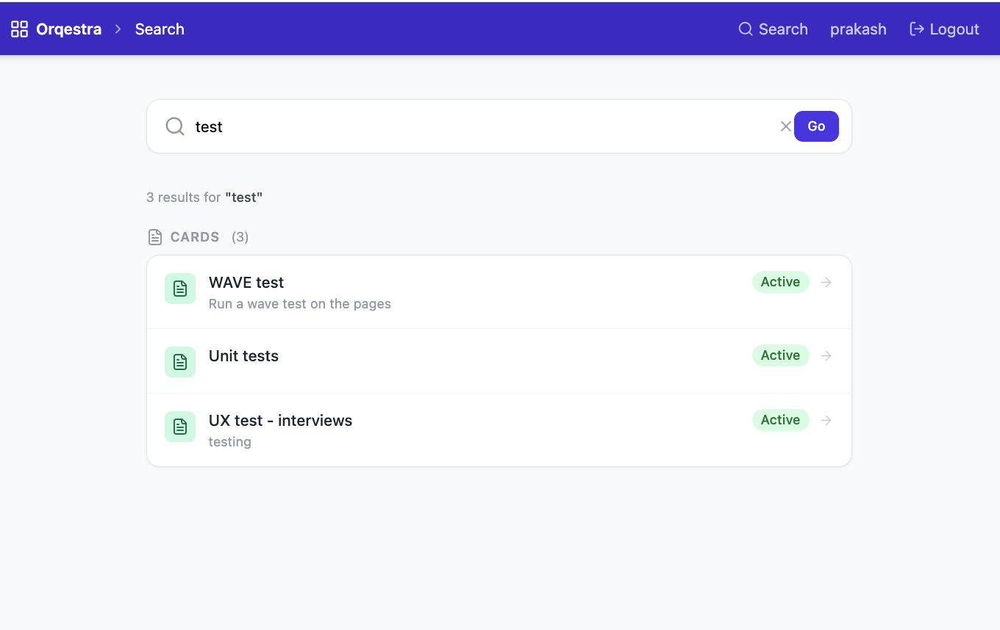

# Orqestra - An event-driven collaboration and workflow platform

Orqestra is an actively developed platform for orchestrating workflows, entities, and collaboration in real time. It is designed with an event-driven architecture to support scalable, distributed systems across research and enterprise environments.

The platform focuses on structured data, real-time updates, searchability, and full auditability of system activity.


## 🚀 Current Status

⚠️ Work in Progress (early prototype)

- Project setup (Flask + React)
- Authentication (JWT-based)
- Core entity management (workspaces, boards, columns, cards)
- Extensible metadata schema (JSONB)
- Role-based access control (RBAC)
- Event / audit logging (foundation for activity streams)
- Trello-like board UI with drag-and-drop
- Full-text search with pluggable backend (PostgreSQL FTS default, OpenSearch optional)
- Global search UI with grouped results across all entity types


## 🧠 Problem Statement

Modern collaboration and workflow systems often suffer from:

- Limited extensibility beyond simple "tasks"
- Poor visibility into system activity and history
- Weak search across entities and interactions
- Lack of real-time collaboration capabilities
- Tight coupling between components (hard to scale)

Orqestra addresses these gaps by introducing:

- An event-driven architecture
- Extensible entity models (not limited to tasks)
- Real-time updates and activity streams (planned)
- Search-first design with OpenSearch
- Auditability and traceability by design


## 🏗️ Architecture Overview

### Core Components
- **Backend:** Flask (Python)
- **Frontend:** React + TypeScript + Vite
- **Database:** PostgreSQL
- **Search:** PostgreSQL FTS (default, zero extra infra) or OpenSearch (optional, for scale)
- **Event Layer:** Planned – async/event-driven pattern
- **Storage:** AWS S3 (planned)
- **Deployment:** Docker Compose (local), AWS EC2 (planned)

### High-Level Flow
```
(Client - React)
        ↓
(Flask Backend / API Layer)
        ↓
(Event Layer - Planned)
   ↓              ↓
(PostgreSQL)   (OpenSearch)
        ↓
(Optional Storage - S3)
```

## 🔑 Core Features
- User authentication (JWT-based)
- Role-based access control (RBAC – admin / member / viewer)
- Generic entity management (workspaces, boards, columns, cards)
- Trello-like board UI with drag-and-drop cards
- Event logging and audit streams
- Global search UI — search across all workspaces, boards and cards from any page
- Pluggable search backend — PostgreSQL FTS out of the box, switch to OpenSearch for scale
- Versioning of entities (planned)
- RESTful API design


## 🧩 Design Principles
- Event-driven first → every action is an event
- Extensibility → not limited to "tasks"
- Search-centric → pluggable search (PostgreSQL FTS or OpenSearch) as a core component
- Auditability → trace everything
- Scalability → loosely coupled components
- Cloud-ready → AWS-native deployment path


## 📦 Project Structure

```
repo-root/
│
├── backend/
│   ├── app/
│   │   ├── main.py               # Flask app factory
│   │   ├── extensions.py         # db, jwt, cors
│   │   ├── api/
│   │   │   ├── deps.py           # auth decorators
│   │   │   ├── routes.py         # blueprint registration
│   │   │   └── v1/
│   │   │       ├── auth.py
│   │   │       ├── users.py
│   │   │       ├── entities.py
│   │   │       ├── members.py
│   │   │       └── events.py
│   │   ├── core/
│   │   │   ├── config.py         # pydantic-settings (incl. SEARCH_BACKEND)
│   │   │   └── security.py       # password hashing
│   │   ├── models/               # SQLAlchemy models
│   │   ├── schemas/              # Pydantic schemas
│   │   └── services/
│   │       └── search/
│   │           ├── base.py           # SearchService ABC + SearchResult
│   │           ├── postgres.py       # PostgreSQL FTS implementation
│   │           ├── opensearch_service.py  # OpenSearch implementation
│   │           └── factory.py        # resolves backend from SEARCH_BACKEND env var
│   ├── server.py                 # entrypoint
│   ├── requirements.txt
│   ├── Dockerfile
│   └── .env.example
│
├── frontend/
│   ├── src/
│   │   ├── api/                  # axios client + endpoints
│   │   ├── store/                # Zustand state (auth, board)
│   │   ├── types/                # TypeScript types
│   │   ├── components/
│   │   │   ├── ui/               # Button, Input, Modal, Spinner
│   │   │   ├── layout/           # Navbar (with Search link)
│   │   │   ├── board/            # BoardCard, BoardColumn, CardModal
│   │   │   └── members/          # MembersModal
│   │   └── pages/
│   │       ├── LoginPage.tsx
│   │       ├── RegisterPage.tsx
│   │       ├── WorkspacesPage.tsx
│   │       ├── WorkspacePage.tsx
│   │       ├── BoardPage.tsx
│   │       └── SearchPage.tsx    # global search with grouped results
│   ├── package.json
│   └── .env.example
│
├── docs/
│   └── architecture.md
│
├── docker-compose.yml            # includes optional opensearch profile
├── .env.example                  # template for root-level env overrides
├── .env                          # local environment overrides (not committed)
├── .gitignore
└── README.md
```


## 🐳 Running with Docker Compose (recommended)

### Prerequisites
- [Docker](https://docs.docker.com/get-docker/) and Docker Compose installed

### 1. Clone the repo

```bash
git clone <repo-url>
cd Orqestra
```

### 2. Configure environment

Copy the backend env example and set a secret key:

```bash
cp backend/.env.example backend/.env
```

Edit `backend/.env` and set a strong `SECRET_KEY`:

```
SECRET_KEY=your-random-secret-here
```

Generate one with:

```bash
python -c "import secrets; print(secrets.token_hex(32))"
```

If you plan to use **OpenSearch** (optional), also create a root-level `.env` from the provided example:

```bash
cp .env.example .env
```

Then edit `.env` and set `SEARCH_BACKEND=opensearch` along with your OpenSearch credentials. See [Search Backends](#-search-backends) for full details. If you skip this, search defaults to PostgreSQL FTS with no extra setup required.

### 3. Build and start all services

```bash
docker compose up --build
```

This starts three services:

| Service | URL | Description |
|---|---|---|
| `frontend` | http://localhost:3000 | React UI |
| `backend` | http://localhost:8000 | Flask API |
| `db` | localhost:5432 | PostgreSQL |

### 4. Register and log in

Open **http://localhost:3000** in your browser. You will be redirected to the login page.


Click **Sign up** to create your account, then log in. No pre-seeded users exist — the first account you register is yours.

### 5. Create a workspace

After logging in you land on the Workspaces page. Click **+ New workspace**, give it a name, and hit **Create**.


### 6. Create a board

Click into a workspace and create your first board with **+ New board**.


### 7. Add columns and cards

Open a board to get the Dashboard view. Use **+ Add another list** to create columns, then **+ Add a card** inside each column. Cards can be dragged between columns, edited, and commented on.


### 8. Invite members

CLick on member option to add/remove members to the board and set their role either as Viewer or Editor.


### 9. Search

Search is enabled by default using **PostgreSQL full-text search** — no extra setup needed. A **Search** link appears in the navbar on every page. Clicking it opens the search page where you can find workspaces, boards and cards by keyword.

Results are grouped by entity type and each result links directly to the relevant page.


### 10. Stop services

```bash
docker compose down
```

To also remove the database volume:

```bash
docker compose down -v
```

### Rebuilding after code changes

```bash
docker compose up --build
```

The backend volume mounts `./backend` into the container so Python changes are reflected without a full rebuild. The frontend runs `npm install && npm run dev` on start, so dependency changes require a restart (`docker compose restart frontend`).


## 🔍 Search Backends

Orqestra ships with a pluggable search layer. You choose the backend based on your available compute resources.

| Backend | When to use | Extra infra |
|---|---|---|
| `postgres` (default) | Development, small deployments | None — uses the existing PostgreSQL instance |
| `opensearch` | Large deployments with 100s of boards and 1000s of cards, or knowledge-base use cases | Requires a running OpenSearch node (≥2 GB RAM) |

### PostgreSQL FTS (default)

No configuration needed. The default `SEARCH_BACKEND=postgres` uses `tsvector` / `websearch_to_tsquery` directly on the entities table. Works immediately after starting the stack.

### Enabling OpenSearch

#### 1. Start the OpenSearch container

OpenSearch is defined as an opt-in Docker Compose profile and is not started by default:

```bash
docker compose --profile opensearch up -d opensearch
```

Wait for it to become healthy (usually ~30 seconds):

```bash
docker compose ps opensearch
```

#### 2. Configure the backend

Add the following to your `.env` file (create one at the repo root if it does not exist):

```env
SEARCH_BACKEND=opensearch
OPENSEARCH_HOST=localhost
OPENSEARCH_PORT=9200
OPENSEARCH_USER=admin
OPENSEARCH_PASSWORD=your-opensearch-password
```

> **Note:** If running inside Docker Compose, set `OPENSEARCH_HOST=opensearch` (the service name) instead of `localhost`. You can pass this in `docker-compose.yml` under the `backend` service `environment` block.

#### 3. Restart the backend

```bash
docker compose restart backend
```

The backend will connect to OpenSearch on startup, create the `orqestra_entities` index if it does not exist, and begin indexing new and updated entities automatically.

#### 4. Verify the connection

Check the backend logs:

```bash
docker compose logs backend | grep -i opensearch
# Expected: Created OpenSearch index 'orqestra_entities'
```

Or query the index directly:

```bash
curl -sk https://localhost:9200/orqestra_entities/_count \
  -u admin:your-opensearch-password | python3 -m json.tool
```

#### Switching back to Postgres

Set `SEARCH_BACKEND=postgres` in your `.env` and restart the backend. The OpenSearch container can be left running or stopped:

```bash
docker compose stop opensearch
```

#### Note on backfilling existing data

When you first enable OpenSearch, only entities created or updated **after** the switch are indexed. Entities that existed before will not appear in search results until they are edited. A bulk re-index script is planned for a future release.


## ⚙️ Running locally (without Docker)

### Backend

```bash
cd backend
python -m venv venv
source venv/bin/activate       # Windows: venv\Scripts\activate
pip install -r requirements.txt

cp .env.example .env           # then set DATABASE_URL and SECRET_KEY

python server.py
```

Requires a running PostgreSQL instance. Update `DATABASE_URL` in `.env` accordingly.

### Frontend

```bash
cd frontend
npm install
npm run dev
```

Open http://localhost:3000. The Vite dev server proxies all `/api` requests to `http://localhost:8000`.


## 🛣️ Roadmap

### Short-term
- Dockerfile for frontend (production build with Nginx)
- User assignment to cards and boards
- Bulk re-index script to backfill existing entities into OpenSearch
- Real-time cross-member updates — card and list changes broadcast live to all board members via WebSockets (Flask-SocketIO), eliminating the need to reload the page
- Attachments, so that members can upload relevant files in the cards

### Mid-term
- Activity stream (event-driven)
- Entity versioning system
- Audit log viewer in UI
- Faceted search and filters (by status, assignee, date range)

### Long-term
- Event bus integration (async processing)
- AI-assisted workflows (AWS Bedrock)
- Semantic search and recommendations
- Workflow automation / orchestration engine


## 📌 Notes

This project is being developed iteratively with a focus on:

- Clean, modular architecture
- Event-driven system design
- Scalability and extensibility
- Alignment with research and platform engineering use cases


## 👤 Author

Prakash Gaur
